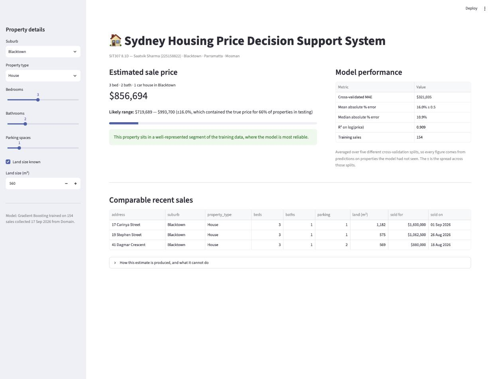

# SIT307 8.1D — Sydney housing price prediction

Saatvik Sharma (225158822) · Deakin University · SIT307

Predicting sale prices in three Sydney markets that behave very differently: Blacktown,
Parramatta and Mosman. The fitted model is served through a small Streamlit app.

## Dataset

`data/sydney_housing.csv` holds 164 sold listings I transcribed by hand on 17 September 2026
from the public "Sold" pages of domain.com.au, across 11 result pages. No scraper. Ten had no
published price, so 154 are used for modelling.

| Suburb | Properties | Median | Range |
|---|---|---|---|
| Parramatta | 46 | $595,000 | $250,000 – $2,080,000 |
| Blacktown | 56 | $905,000 | $375,000 – $1,900,000 |
| Mosman | 52 | $1,565,000 | $610,000 – $11,650,000 |

`data/collection_log.md` lists the search URLs and the problems I hit while collecting.
`data/worst_case_profiles.csv` holds the profile-page detail behind the Part 4 error analysis.

## Results

Each model is scored over five cross-validation fold assignments and reported as mean ± sd. At
n=154 a single split moves MAPE by more than a percentage point, so one split proves very little.

| Model | CV MAE | CV MAPE | CV R² (log) |
|---|---|---|---|
| Ridge | $330,107 | 16.97% ± 0.52 | 0.895 |
| Random Forest | $312,889 | 16.25% ± 0.69 | 0.902 |
| Gradient Boosting | $312,207 | 15.93% ± 0.48 | 0.910 |

Median absolute error is 10.9%. Just under half of all predictions land within 10% of the sale
price, and 77% within 20%. Accuracy is very uneven across the three suburbs: Blacktown 9%,
Parramatta 15%, Mosman 23%. The five worst errors are all Mosman houses and between them carry
43% of the total absolute error.

I predicted before fitting that the random forest would win. It lost on all five splits. The
margin over boosting is only 0.32pp, which is smaller than the spread a model shows across
splits, so the two tree models are not really separable at this sample size.

Two engineered features were built and then dropped. `months_since_start` turned out to be a
suburb label in disguise, because Mosman needed older result pages to reach thirty published
prices. `is_auction` is not knowable before a sale, so the app has no honest way to ask for it.
Dropping both improved the model.

## Running it

```bash
python3 -m venv .venv && source .venv/bin/activate
pip install -r requirements.txt

# runs the analysis and writes app/model.joblib
jupyter nbconvert --to notebook --execute --inplace SIT307-8.1D-analysis.ipynb

# serves the app at http://localhost:8501
streamlit run app/app.py
```

The app needs `app/model.joblib`, so run the notebook at least once first. In the sidebar, set
suburb, property type, bedrooms, bathrooms, parking and land size. You get a predicted price, a
±16% range with its measured coverage (66% of properties in testing), three comparable sales,
and a warning above $3m. A house can also be entered with land size unknown, which is the
condition behind the largest single error.



## Layout

```
data/     raw and cleaned datasets, collection log, Part 4 profile evidence
figures/  generated figures and app screenshots
results/  CV metrics, ablation, feature importance, worst predictions,
          and report_numbers.json, which the report quotes from
app/      Streamlit app, fitted pipeline, model schema
SIT307-8.1D-analysis.ipynb    Parts 1–4
report.tex / report.pdf       submitted report
```

## Limitations

The model never sees internal floor area, street position within a suburb, outlook, aspect,
renovation quality, floor level, strata levies or zoning. Every large error in testing traces
back to one of those. Above $3m it is closer to guessing than to valuing, and the errors run in
both directions rather than consistently low. Treat it as a starting point for a comparable-sales
analysis rather than a valuation.

## GenAI acknowledgement

I used Claude (Anthropic) for project planning, writing and debugging code, and checking the
report for grammar and clarity. An AI-assisted review also flagged that my model comparison
rested on a single fold assignment, and that a fairness claim in an earlier draft was
unsupported. I retested both and changed the conclusions. Suburb selection, modelling decisions
and all interpretation are my own. See §7 of `report.pdf`.
